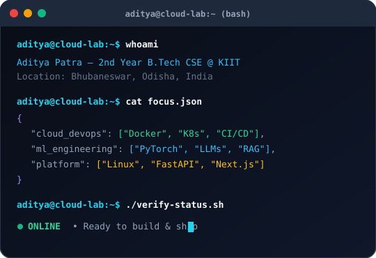
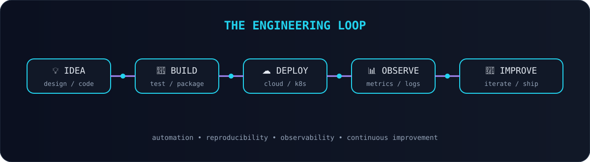
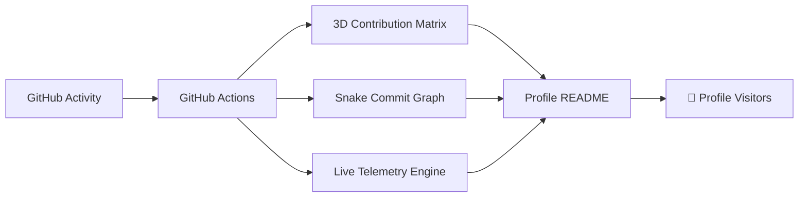
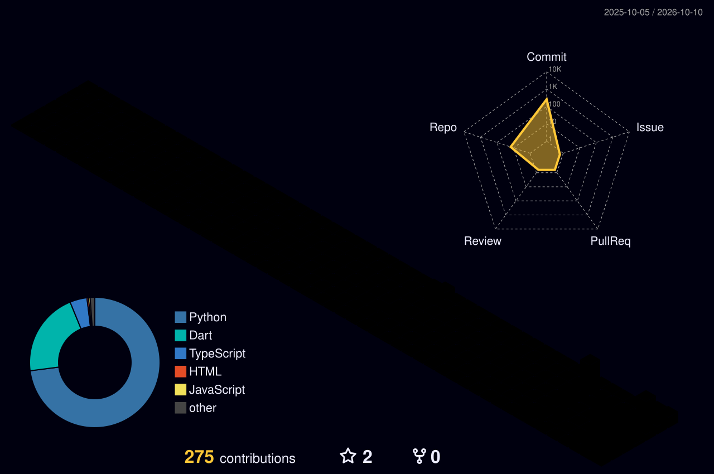
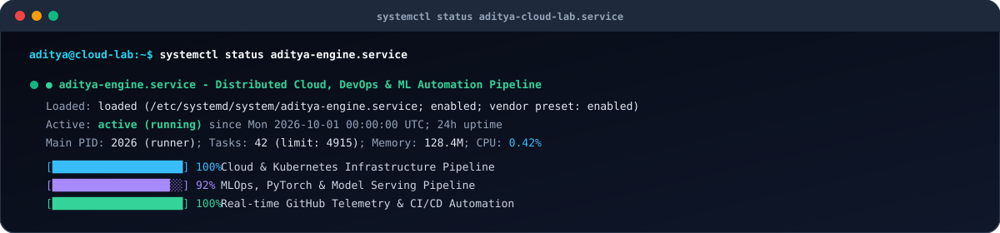

<div align="center">



<br/>

<a href="https://github.com/AdityaPatra-dev"></a>

<br/>

<a href="https://adityapatradev.web.app/" target="_blank"></a>
<a href="https://github.com/AdityaPatra-dev"></a>
<a href="https://github.com/AdityaPatra-dev?tab=followers"></a>
<a href="https://github.com/AdityaPatra-dev/AdityaPatra-dev/issues/new?template=guestbook.md&title=%F0%9F%91%8B+%5BGuestbook%5D+Note+from+%40"></a>
<a href="mailto:adityapatraraj@gmail.com"></a>

<br/><br/>

<!-- Interactive Quick Navigation Bar -->
<table align="center">
  <tr>
    <td align="center">
      <a href="#-interactive-terminal-cli"><b>💻 Terminal CLI</b></a> &nbsp;•&nbsp;
      <a href="#-featured-projects"><b>🚀 Projects</b></a> &nbsp;•&nbsp;
      <a href="#-engineering-stack"><b>🧰 Tech Stack</b></a> &nbsp;•&nbsp;
      <a href="#-live-profile-telemetry"><b>📡 Telemetry</b></a> &nbsp;•&nbsp;
      <a href="#-github-analytics"><b>📊 Analytics</b></a> &nbsp;•&nbsp;
      <a href="#-visitor-guestbook"><b>✍️ Guestbook</b></a> &nbsp;•&nbsp;
      <a href="#-connect"><b>🌐 Connect</b></a>
    </td>
  </tr>
</table>

</div>

---

## 🧑‍💻 `aditya@cloud-lab:~$ ./about-me`

<table><tr><td width="58%" valign="top">

### 👋 Hey, I'm Aditya Patra

I'm a **2nd-year B.Tech Computer Science & Engineering student at KIIT** (Bhubaneswar, India) specializing in **Cloud Infrastructure, DevOps, and Machine Learning Systems (MLOps)**.

I believe true engineering comes from understanding systems from first principles:

```text
code → containers → infrastructure → deployment → observability → ML systems
```

```text
┌────────────────────────────────────────────────────────┐
│                   CURRENT MISSION                      │
├────────────────────────────────────────────────────────┤
│ ☁️  Cloud Architecture (AWS, GCP, Microservices)       │
│ ⚙️  DevOps & GitOps (Docker, Kubernetes, CI/CD)         │
│ 🧠  Machine Learning & Deep Learning (PyTorch)        │
│ 🚀  MLOps, Model Serving & RAG Pipelines              │
│ 🐧  Linux Internals, Networking & Observability       │
│ 🌍  Building in public & Open Source                   │
└────────────────────────────────────────────────────────┘
```

🌐 **Check out my live portfolio:** [adityapatradev.web.app](https://adityapatradev.web.app/)

</td><td width="42%" valign="top"></td></tr></table>

---

## ⚡ Interactive Terminal CLI

> **Click any command below** to expand the simulated terminal output and explore my background, engineering philosophy, and active workflows.

<details>
<summary><b>▶ <code>aditya --profile</code></b> &nbsp; <i>(Personal identity, education & core philosophy)</i></summary>

<br/>

```bash
$ aditya --profile

[USER PROFILE]
Name        : Aditya Patra
Role        : Cloud, DevOps & ML/MLOps Engineer
University  : KIIT (Kalinga Institute of Industrial Technology), Bhubaneswar, India
Degree      : B.Tech Computer Science & Engineering (2nd Year)
Status      : Active Student & Systems Builder
Core Mantra : "Build → Break → Learn → Automate → Ship → Repeat"
Website     : https://adityapatradev.web.app/
```

</details>

<details>
<summary><b>▶ <code>aditya --cloud-devops</code></b> &nbsp; <i>(Infrastructure, containers, CI/CD & orchestration)</i></summary>

<br/>

```bash
$ aditya --cloud-devops

[INFRASTRUCTURE & AUTOMATION MATRIX]
• Virtualization & Containers : Docker, Containerd, Multi-stage builds, Distroless images
• Orchestration               : Kubernetes (Pod scheduling, Services, Ingress, Deployments)
• CI/CD Automation           : GitHub Actions, Jenkins, automated testing & linting pipelines
• Cloud Platforms             : AWS, Google Cloud Platform (GCP), Firebase
• Reverse Proxies & Network   : Nginx, Cloudflare DNS & SSL/TLS termination, Linux iptables
• Observability               : Prometheus, Grafana, Systemd service monitoring, Structured logs
```

</details>

<details>
<summary><b>▶ <code>aditya --mlops</code></b> &nbsp; <i>(Machine Learning, model serving & knowledge engineering)</i></summary>

<br/>

```bash
$ aditya --mlops

[MACHINE LEARNING & PRODUCTION PIPELINES]
• Frameworks          : PyTorch, TensorFlow, Scikit-learn
• LLMs & Generative AI: Transformer architectures, Fine-tuning, Tokenization, Prompt engineering
• RAG Systems         : Vector databases, Context retrieval, Chunking strategies, Semantic search
• Model Serving       : FastAPI microservices, REST endpoints, Dockerized model packaging
• Repository Highlight: github.com/AdityaPatra-dev/mastering-llms
```

</details>

<details>
<summary><b>▶ <code>aditya --learning</code></b> &nbsp; <i>(Active learning sprints & technical roadmap)</i></summary>

<br/>

- ☸️ **Cloud-Native Resilience:** Advanced Kubernetes networking, Helm charts, and GitOps workflows.
- 🐳 **Container Optimization:** Hardened Docker rootless containers and vulnerability scanning.
- 🤖 **Production MLOps:** Model registries, inference optimization, batch vs real-time serving.
- 📊 **Telemetry Engineering:** OpenTelemetry instrumentation, distributed tracing, and metrics alerting.
- 🔎 **Retrieval-Augmented Generation:** High-recall hybrid search combining dense and sparse vector retrievers.

</details>

<details>
<summary><b>▶ <code>aditya --contact</code></b> &nbsp; <i>(Reach out for collaborations, projects or hiring)</i></summary>

<br/>

```text
Interested in collaborating on Cloud/DevOps infrastructure, open-source utilities, or ML systems?

📧 Email    : adityapatraraj@gmail.com
💼 LinkedIn : https://linkedin.com/in/aditya-patra-0a6530289
🌐 Website  : https://adityapatradev.web.app/
🐦 X        : https://x.com/Aditya_patra943
```

</details>

---

## 🚀 Featured Projects

> Pinned repositories and live production builds. Discover more on my [GitHub repositories page](https://github.com/AdityaPatra-dev?tab=repositories).

<div align="center">

<a href="https://github.com/AdityaPatra-dev/portfolio"></a>
<a href="https://github.com/AdityaPatra-dev/DeployHub"></a>

<br/>

<a href="https://github.com/AdityaPatra-dev/CloudArena"></a>
<a href="https://github.com/AdityaPatra-dev/mastering-llms"></a>

<br/>

<a href="https://github.com/AdityaPatra-dev/Taarak"></a>
<a href="https://github.com/AdityaPatra-dev/Text-To-Video-Generator"></a>

</div>

<br/>

| Project | Highlights | Tech Stack | Status |
| :--- | :--- | :--- | :---: |
| 🌐 **[Aditya Patra Portfolio](https://github.com/AdityaPatra-dev/portfolio)** | Modern developer portfolio web application. | `TypeScript` `React` `Firebase` | [**Live Demo**](https://adityapatradev.web.app/) |
| ☁️ **[DeployHub](https://github.com/AdityaPatra-dev/DeployHub)** | Automated deployment platform for orchestrating cloud environments. | `DevOps` `Docker` `CI/CD` | **Active** |
| ⚡ **[CloudArena](https://github.com/AdityaPatra-dev/CloudArena)** | Cloud sandbox and environment management CLI for reproducible infrastructure. | `Python` `Cloud SDKs` `Linux` | **Active** |
| 🧠 **[mastering-llms](https://github.com/AdityaPatra-dev/mastering-llms)** | Curated knowledge base on Large Language Model architecture, fine-tuning & RAG. | `PyTorch` `Transformers` `RAG` | **Active** |
| 📱 **[Taarak](https://github.com/AdityaPatra-dev/Taarak)** | Feature-rich cross-platform mobile utility application. | `Dart` `Flutter` `Mobile` | **Active** |
| 🎬 **[Text-To-Video-Generator](https://github.com/AdityaPatra-dev/Text-To-Video-Generator)** | Machine learning pipeline translating descriptive text into video outputs. | `Python` `OpenCV` `GenAI` | **Active** |

---

## 🌌 The Profile Engine

> This profile is intentionally engineered as a self-updating CI/CD system rather than a static document.





---

## 🧊 3D Contribution Matrix

<div align="center"><a href="https://github.com/yoshi389111/github-profile-3d-contrib"></a></div>

---

## 📡 Live Profile Telemetry

<div align="center"></div>

---

## 🧰 Engineering Stack

<div align="center">

### 💻 Languages


### ☁️ Cloud / DevOps / Infrastructure


### 🤖 Machine Learning / AI / Data


### 🌐 Frontend & Cloud Platforms


</div>

<br/>

<div align="center">

| ☁️ Cloud & Infra | ⚙️ DevOps & GitOps | 🧠 Machine Learning | 🚀 MLOps & Serving |
| :---: | :---: | :---: | :---: |
| Cloud Architecture | Docker & Containers | Model Training | FastAPI Serving |
| VPC & Networking | CI/CD Automation | PyTorch / Deep Learning | Model Observability |
| Linux System Internals | Kubernetes Clusters | Transformers & LLMs | Pipeline Automation |
| High Availability | Observability & Logging | RAG & Vector Search | Containerized Inference |

</div>

---

## 📊 GitHub Analytics

<div align="center">

<a href="https://github.com/AdityaPatra-dev"></a>
<a href="https://github.com/AdityaPatra-dev"></a>

<br/><br/>

<a href="https://github.com/AdityaPatra-dev"></a>

</div>

---

## 🐍 Contribution Snake

<div align="center"><picture><source media="(prefers-color-scheme: dark)" srcset="./output/github-contribution-grid-snake-dark.svg"><source media="(prefers-color-scheme: light)" srcset="./output/github-contribution-grid-snake.svg"></picture></div>

---

## ✍️ Visitor Guestbook

<div align="center">

<table>
  <tr>
    <td align="center">
      <h3>👋 Thanks for visiting my profile!</h3>
      <p>Have project feedback, want to talk about Cloud/ML, or just want to say hi?</p>
      <a href="https://github.com/AdityaPatra-dev/AdityaPatra-dev/issues/new?template=guestbook.md&title=%F0%9F%91%8B+%5BGuestbook%5D+Note+from+%40">
        
      </a>
    </td>
  </tr>
</table>

</div>

---

## 🖥️ `systemctl status aditya-cloud-lab`



---

## 🌐 Connect

<div align="center">

<a href="https://adityapatradev.web.app/" target="_blank"></a>
<a href="mailto:adityapatraraj@gmail.com"></a>
<a href="https://linkedin.com/in/aditya-patra-0a6530289" target="_blank"></a>
<a href="https://x.com/Aditya_patra943" target="_blank"></a>
<a href="https://youtube.com/@Aditya_Learns_tech" target="_blank"></a>
<a href="https://instagram.com/aditya_patra_75" target="_blank"></a>
<a href="https://reddit.com/user/ConsciousClue6179" target="_blank"></a>

</div>

---

<div align="center">

### `Build → Break → Learn → Automate → Ship → Repeat`


</div>
